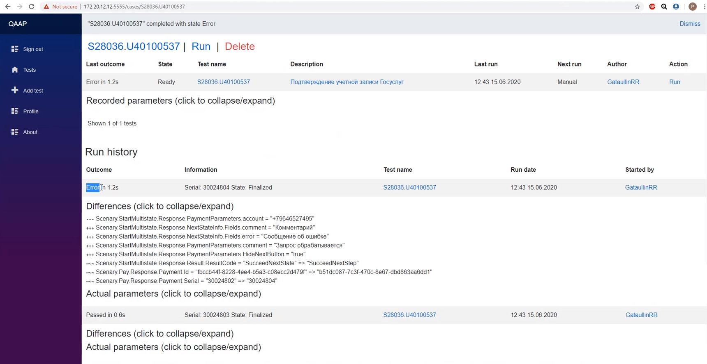

# Testkit

Stack: Balzor WASM + SignalR + Kafka + EFCore3.1 + gRPC (before some commit)

Platform for automated testing. The idea is to record in background, just as an example, http requests and responses so that to playback it later, compare actual response with previous one and mark it as passed or failed. Any assertion logic is possible, any incoming\outcoming data source and type is supported via custom adapter (http rq\rs are only example).

Created and was actually used with adapter for eKassir hub (not present in repository). In this case it records services' requests to hub by reading SOAP messages from Reddis, and allows requests to be play backed so that to detect changes in responses from gateway or in actual payment status in hub. It allowed to create tests for gateways with no codding involved!

Rather unfinished project utilizing micro service architecture (6 services in total). The code is awful as it was being written fast and a lot of new technologies were employed which took a while to figure out how to use them properly. Actually it's the second full stack project after https://github.com/GataullinRR/Blog which was way simpler in some kind

And...
Do not look at Kafka consumer implementation... You have been warned!

# Some images

# Notes

Kafka installation:
https://docs.confluent.io/current/quickstart/ce-docker-quickstart.html

